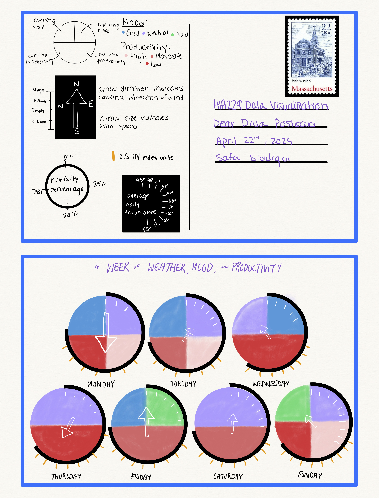

```{r setup, include=FALSE}
knitr::opts_chunk$set(echo = FALSE)
```

Inspired by Giorgia Lupi and Stefanie Posavec's [Dear Data postcard exchange](https://www.dear-data.com/theproject), I spent one week observing how my mood and productivity are related to various elements of weather. The top half of the image is the back side of the postcard, which includes a legend about how to interpret the graph. Each element in the legend corresponds to  a weather component, mood, or productivity. Each circle in the graph represents one day of observation. Scroll down to learn more!



**Insights: What insights did you concretely identify with your visualization?**

I made an effort to include lots of information so there were lots of insights to identify. It is evident that I had a neutral mood throughout most of the observation week. This week I also had particularly low productivity. Wind speed was mostly moderate throughout the week, as was UV index. I was surprised to see that good moods were correlated with relatively cooler weather. Good moods were more common in the evenings, and high productivity was more common in the mornings. Overall there is not a strong, identifiable association between UV index, humidity, and mood or productivity. Based on this data, I can’t definitively say how my mood and productivity changes with the weather.


**ii. Reflection Pt I: Lupi and Posavec said that Dear Data helped them “live a quantified life, and become more attuned to their surroundings.” What did you learn about yourself through this process? How did you think about data collection and data visualization? What is your approach to data collection and to data visualization? How easy or difficult was it for you to identify patterns and insights in your data?**

This process made me think more explicitly about my daily mood and productivity. I also found myself being more attentive to details/nuances of the weather, beyond temperature. The data collection process was fairly straightforward; I set reminders on my phone to make note of my mood and productivity twice a day. At the end of the day I gathered the weather statistics from my phone as well. This was an efficient system, as it was easy to collect the data. I found the visualization portion quite challenging though. I ended up choosing a circular icon to represent each day, inspired by Posavec’s Week of Privacy postcard. I felt each icon was similar to a clock face which visually relates to the comparisons between mornings and evenings. I then considered elements to put on top of the circle, such as an arrow indicating the direction and speed of wind that day. Humidity was also easy to include using the outline of the circle, given that humidity is typically reported as a percentage. I added UV index through “rays” that indicate 0.5 units each, which felt thematically appropriate. I struggled to find a way to include daily average temperature, but ended up going with ticks showing how many degrees (Fahrenheit) above 45 the temperature was that day. At this point I liked how much each icon looked like a clockface, and also felt I had maxed out on variables. I ended up being able to include 7 variables in my postcard (mood, productivity, wind speed, wind direction, average daily temperature, UV index, and humidity). I think this format made it easiest to identify patterns and insights in mood, productivity, humidity, wind speed, and wind direction. UV index and daily average temperature were less prominent visually, and also varied much less, making patters harder to identify.


**iii. Reflection Pt II: What was your favorite part of this project? What did you find most difficult? If you could do it again, what would you do differently?**

My favourite part of this project was visualizing the data on the postcard. This was also the most challenging, but it made the trial-and-error process very enjoyable. I also enjoy arts and crafts so it was nice to indulge in that sort of thinking for class work (which is rare!). If I could do this project again, I would choose to collect precipitation data as well because I think it could be relevant to mood and productivity. I would also experiment more with visualization shapes; as I finished up the postcard I found myself still thinking about other icons and how effective they might have been, such as a star shape. In general I think it would be fun to collect data over a longer period, and also take more time to figure out the visualization. This would result in a more rich, informative, and visually-engaging postcard.


